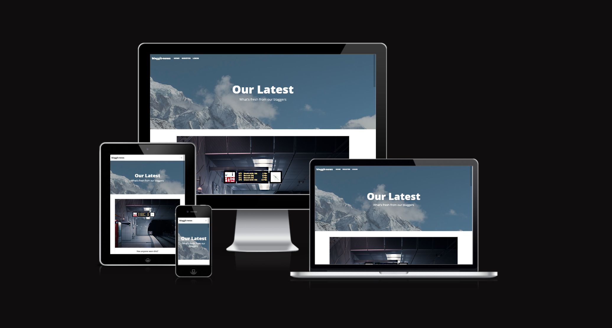
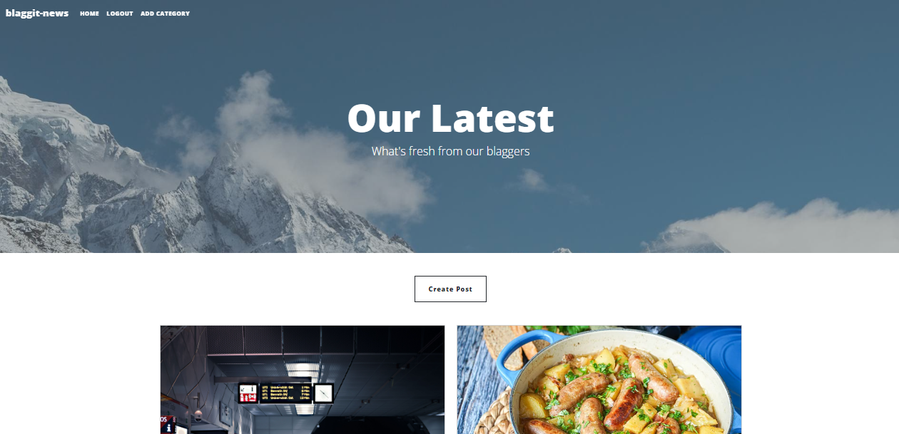
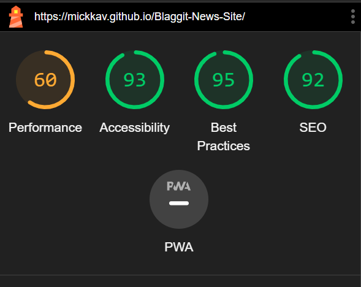
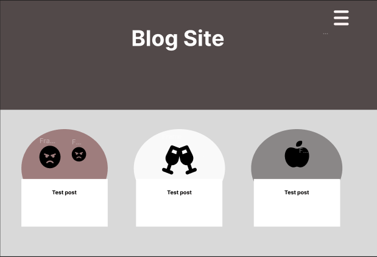
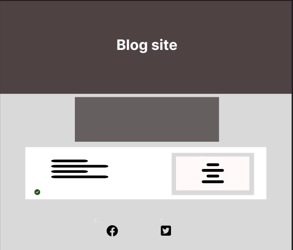

# Blaggit-news (Portfolio 4)

Visit [live website here]("[https://mickkav.github.io/RockPaperScissorsLizardSpock/](https://mickkav.github.io/Blaggit-News-Site/)")



## About This Project
Blaggit News is a web application designed for publishing and sharing blog posts. It provides features such as user authentication, post creation, editing, and deletion, as well as category management. 

### Built with
The project is built using Django, a high-level Python web framework, and incorporates HTML5, CSS3, JavaScript, and Bootstrap for styling and interactivity.

### Bugs
- There were a few bugs and errors along the way but have since been alleviated. There a few features that I would like to add in the future such as user profiles and comment replies.

#### Bugs remaining
- No bugs are in the project currently.


## Features



- User Authentication:
    - Allows users to register, log in, and log out.

- Create, Edit, and Delete Posts:
    - Registered users can create new posts, edit existing ones, and delete posts they've authored.

- Comment System:
    - Users can comment on blog posts, and authors can approve or delete comments.

- Category Management:
    - Admins can approve and delete categories for organizing posts.
 
## Testing

### Post Functionality Tests

#### Test Setup

Ensure that you have installed the necessary dependencies for running tests.

```bash```
- pip install -r requirements.txt
- python manage.py test

## Post Detail View Test

**Objective:** Verify that the post detail view redirects to the login page for an unauthenticated user.

**Test Steps:**
1. Create a test user and a test post.
2. Make a GET request to the post detail view URL.
3. Assert that the response status code is 302 (redirect).

## Post Add View Test

**Objective:** Verify that a logged-in user can add a new post.

**Test Steps:**
1. Log in a test user.
2. Make a POST request to the post add view URL with valid post data.
3. Assert that the response status code is 302 (redirect).
4. Assert that the response redirects to the newly created post detail page.
5. Retrieve the newly created post from the database.
6. Assert that the post author is the logged-in user.

The application has been tested extensively to ensure functionality and responsiveness:

- HTML & CSS: Validated with W3C and Jigsaw validators.
- JavaScript: Checked for errors and compatibility.
- Accessibility: Ensured colors and fonts meet accessibility standards using Lighthouse in Chrome DevTools.
- Cross-browser Compatibility: Tested on Chrome, Firefox, and Internet Explorer.
- Responsiveness: Tested on various devices and screen sizes.



## Acknowledgements

This development journey was guided by various resources and communities:

- Stack Overflow: A valuable resource for troubleshooting and problem-solving.
- W3C: Ensured adherence to web standards.
- CSS Tricks & freecodecamp: Provided insights into styling, loops, and layouts.
- Open Source Images: Sourced from platforms like Pexels.

## Wireframing

- Figma was used to get a quick visual Idea to go off of before starting the project.
  
 


## Deployment

The site was deployed using Code Institutes mock terminal in Heroku.

- Steps for deployment:
    - Fork or clone this repository
    - Create a new Heroku app
    - Set the buildbacks to "Python" and "NodeJS" in that order
    - Link the Heroku app to the repository
    - Click on **Deploy**